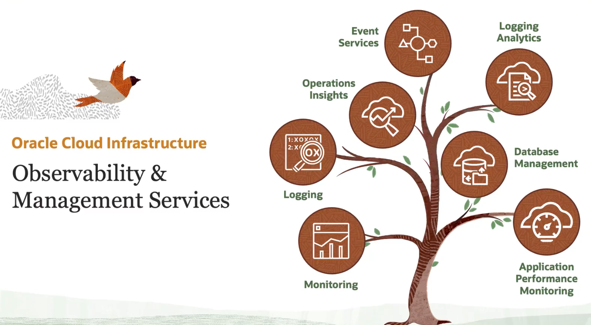

# OCI Observability Service Global Overview

## Overview 

- ### monitoring
  > Monitoring service gives you several out-of-box service metrics that will help you to `monitor the health and performance` of Oracle Cloud Infrastructure resources. Logging service is the `centralized management` for all the logs in your tenancy. The service can ingest log data from different sources, and these logs are classified into 
  > 1. service logs 
  > 2. custom logs 
  > 3. and audit logs
- ### logging
- ### application performance monitoring
  >Application Performance Monitoring, or APM, and that gives you deeper visibility into the performance of your `applications`. The service has got a set of features, like monitoring the application logic, the application stack. It has got other core features, like distributed tracing, synthetic monitoring, which we'll be learning in a later module.
- ### database management
  >Database management service offers you different features to monitor and manage Oracle databases. It could be an external database or Oracle Cloud database, like the Exadata service, and autonomous database services. 
- ### logging analytics
  > Logging analytics is a `machine learning based solution`, and that helps you to aggregate, index, and run analytics across all the log data.
- ### event services
  > The event service keep `track of changes happening to resources in your tenancy`. And then you can take automated action based on that change. As an example, let's say you are uploading a file into the object storage bucket. And then using the event service, you can trigger an action to convert that file into a different format. 
- ### operations insights
  >Operations insights is another native service that gives you insights into resource utilization for achieving better capacity planning for your host and databases.

# skill checks

1. Which is a use case for Oracle Cloud Infrastructure Logging Analytics service?
   
   :white_check_mark: Monitor, aggregate, index, and analyze log data.

   :white_large_square: Label data packets that pass through the Internet gateway.

   :white_large_square: Automatically create instances to collect logs, and analyze and send reports.

   :white_large_square: Automate and manage any logs based on a subscription model.

2. Which service enables you to send alerts through email for metrics that are monitored by using the Monitoring service?

    :white_check_mark: Notification

3. Which Observability and Management service keeps track of changes happening to resources in your tenancy and enables you to take automated actions based on that change?
   
    :white_check_mark: Events
